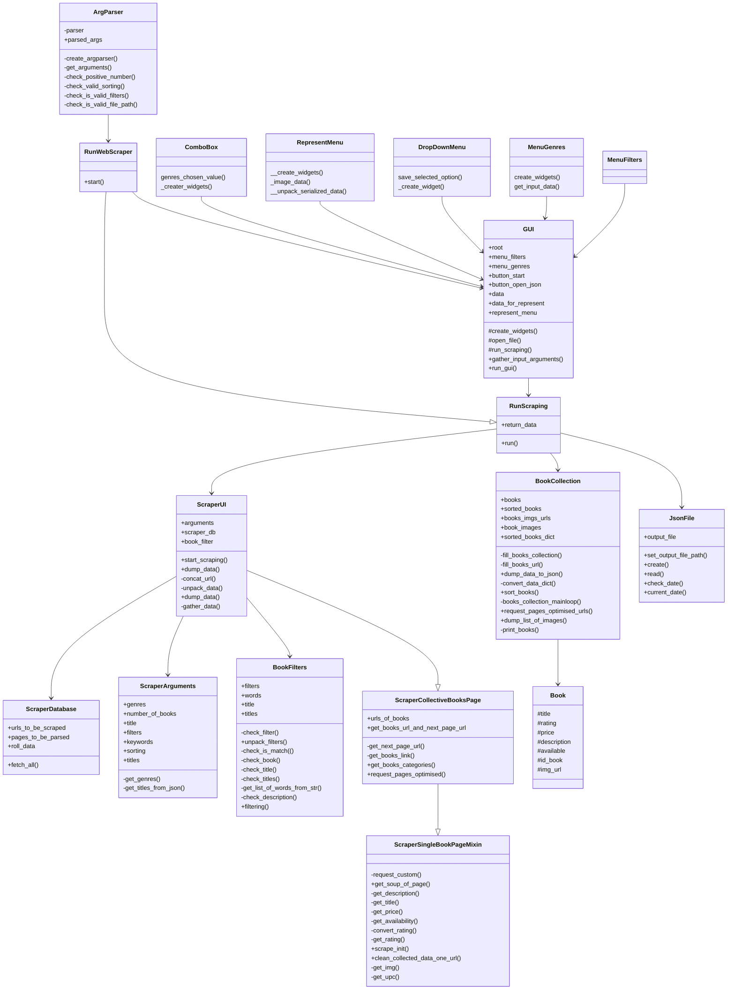

# Python Book Scraper

* ## Project Summary

_The purpose of this project is to collect books from a bookstore (http://books.toscrape.com/), based on user criteria._
* ## Requirements

This script is written for Python 2.7
This script uses [virtualenv with python 2.7](https://docs.python.org/2.7/)

* ## Install Dependencies - Linux
```
sudo apt update
sudo apt install curl python2 python2-setuptools-whl python-tk
curl https://bootstrap.pypa.io/get-pip.py --output get-pip.py
python2 get-pip.py
pip install virtualenv
```

* ## Setup virtualenv
```
virtualenv --python=/usr/bin/python2.7 venv
```


_To run the script successfully you must have first installed the following packages:_
* bs4 BeautifulSoup - version 4.9.3
* lxml - version 4.9.2
* requests - version 2.27.1
* pathlib - version 1.0.1
* grequests - version 0.6.0
* unicode - version 2.9
* unidecode - version 1.2.0
* tk - version 0.1.0
* Pillow - version 6.2.2
* coverage -version 5.5

_You also can check all the requirements in requirements.txt_
 ```
 argparse, requests, beautifulsoup, grequests, pathlib, unicode, unidecode,
 Tkinter, Pillow, coverage
 ```

* ## Usage

The script is used to gather data from [http://books.toscrape.com](http://books.toscrape.com)
You can write the following command in your terminal:
  ```
  python main.py -b 50 -g Science -s rating ascending
  python main.py [-h] [-b <number of books>]
                  [-g <list of genres to search through>] [-s <list of sortings>]
                  [-f <list of filters>] [-d <list of keywords>]
                  [-t <search for a book by title>] [-F <list of book titles>]
                  [-X]
  ```
All arguments are optional.
Note: if you don't pass [-b <number of books>], default value for -b is 10.
  ```

  * -h, --help                             show this help message and exit
  * -b <number of books>                   give number of books as an input
  * -g <list of genres to search through>  give list of genres to search through as an input
  * -s <list of sortings>                  give list of sorting {ascending , descending}
  * -f <list of filters>                   give list of filters
  * -d <list of keywords>                  give list of keywords for searching in the description
  * -t <search for a book by title>        give a title to search for
  * -F <list of book titles>               give list of book titles to search for (from given json)
  * -X                                     opens GUI
  ```

The same options its coming to see on GUI

* ## Tests
*This project have unit tests*
*You can use this command to run the tests:*
  ```
  * python tests/all_tests.py
  ```
*If you want to check the coverage:*
  ```
  * coverage run tests/all_tests.py

   To ignor venv folder use:
  *coverage run --omit 'venv/*' tests/all_tests.py

  * coverage report
  ```
*We have 83% coverage*

* ## Technical Details

### UML diagram:


* ## Workflow:

1. You can start the script with passing the following arguments:
```
python main.py [-h] [-b <number of books>]
                  [-g <list of genres to search through>] [-s <list of sortings>]
                  [-f <list of filters>] [-d <list of keywords>]
                  [-t <search for a book by title>] [-F <list of book titles>]
                  [-X]
```

All the arguments are optional.  

### Default value:
By default, -b "number of books" has value of 10.
If you do not pass any arguments, the script will scrape the first 10 books from site:
```commandline
python main.py
```

### Description of flags:

| Flag          | Description                                                                                                                                                                                                                                                                     |
|---------------|---------------------------------------------------------------------------------------------------------------------------------------------------------------------------------------------------------------------------------------------------------------------------------|
| -b            | Refers to the number of books you want to see in results.<br>Valid input for -b is every positive int.<br>**NOTE** Default value is 10.<br>**Example:**`-b 21`                                                                                                                  |
| -g            | Accepts a list of at least one value.<br>Values here are genres to search for in site.<br>If some of the genres you passed is not met in the site, it is just ignored.<br>**Example:**`-g Classics Romance`                                                                     |
| -f            | Waits for list of filters.<br>Distinct filters shall be separated by comma.<br>Every filter can be comparison between one of the values [rating, available, price] and int number.<br>*Note: rating can be number in range [1, 5]*<br>**Example:**`-f "available>10, rating=5"` |
| -d            | Accepts list of keywords to search for in books descriptions.<br>Put all keywords between "", separated by comma<br>**Example:**`-d "heart, love"`                                                                                                                              |
| -t            | Accepts a title to search for it in site<br>**Example:**`-t "Shakespeare\'s Sonnets"`                                                                                                                                                                                           |
| -F            | Accepts json file.<br> Program will read that file and searches for titles int it.<br>Then scrapes site to search for books with these titles<br>Give the path to file.<br>**Example:**`-F output/output.json`                                                                  |
| -s            | Here you have to pass two values:<br>- First is value, by which you want the results to be sorted. It can be one of the following: [price, rating, available].<br>- Second string is desired sorting direction: [ascending, descending].<br>**Example:**`-s price ascending`    |
| -X            | Opens GUI (graphic user interface).<br>*If you use this flag, other flags (except -h) are ignored. And then you can enter wanted values for flags in gui.                                                                                                                       |
| -h,<br>--help | Displays help.                                                                                                                                                                                                                                                                  |

2. Based on the input:
- if -X flag is passed -> GUI opens
- else -> scraping the site starts from class RunScraper and its method (inherited from RunScraping) run(). Then go to point 5 in this workflow.

3. In GUI there are text boxes, drop-downs, radio buttons, where you can select and enter values as these in flags.
Then start scraping by pressing button "Scrape".

4. Scraping starts from class RunScraping and its method run()

5. An instance of ScraperUI is created, called scraper.<br>
Arguments (passed from terminal or GUI) are given to the constructor of scraper as Namespace instance.<br>

6. Scraper iterates through site until there are enough books scraped.

7. Then data is passed to class BookCollection. There books are sorted (if desired from input args) 

8. Finally, after scraping has finished:
- results are displayed in terminal
- results are also saved in file output_<date_time>.json (which you can see in folder json_operations/output/)
- if you started scraping from GUI, books are also displayed in a frame in that gui. Here you can see all information about every book, plus picture of its cover.
